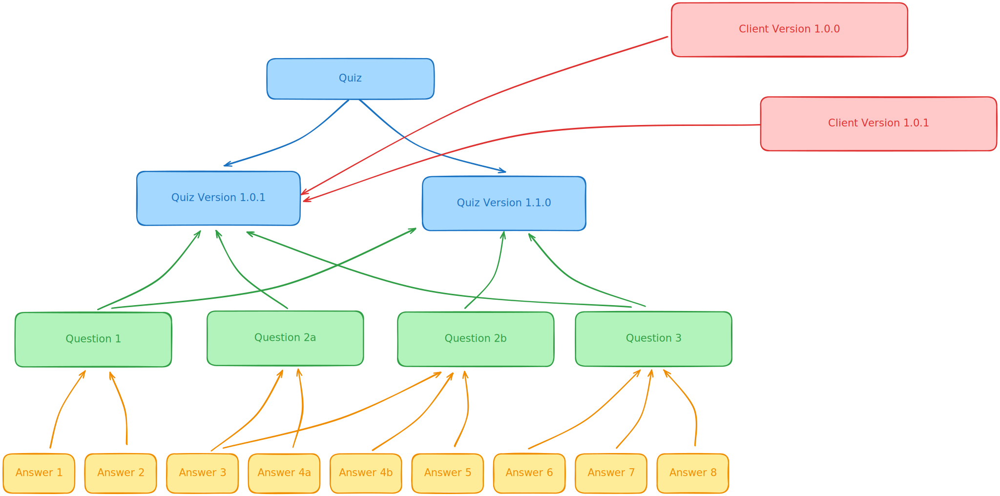

# Awareways Test Assignment #

## Requirements ##

 - docker
 - docker compose
 - npm

## Installation ##

1. Clone repository to some folder:
```shell
  cd ./project-dir
  git clone git@github.com:u1tr0n/awareways-test-assignment.git
```

2. Run Command
```shell
  docker compose build --pull --no-cache
```
to build fresh images

3. Run Command
```shell
    npm run watch
```
to build js and styles

4. Run
```shell
    docker compose up --wait
```
to start containers

5. Load some initial quizzes

`Run commands inside container in /app folder`
```shell
  bin/scripts/fixtures.sh
```

6. Open [https://localhost/admin/](https://localhost/admin/) in your favorite web browser and [accept the auto-generated TLS certificate](https://stackoverflow.com/a/15076602/1352334)

## Testing ##
`Run commands inside container in /app folder`
### PhpUnit Test ###
```shell
  bin/scripts/tests.sh
```

### PhpStan Analyse ###
```shell
  bin/scripts/stan.sh
```

## Technical Specification ##

### Minimum requirement ###
✅ A quiz is a collection of 1 or more questions.

✅ Questions are always closed, meaning, no open (free text) questions.

✅ Questions can be grouped in categories and be tagged for future reference.

✅ A quiz has a version.

✅ Quiz version adjusts with quiz changes.

✅ A quiz can be assigned to a client.

✅ Each client-quiz starts from v1.0.0, while referencing the original quiz version (it was
  created from)

### Bonus ###
✅ Add a new question type:
    Drag & Drop - given a list of terms and 2 topics, provide the correct allocation of terms in
    their belonging topic.

✅ Automatic versioning of quizzes (it is possible to save quiz versions and revisit a
  previous version)

✅ Test coverage.

# Implementation details #

## Dependency diagram ##



## Quiz Versioning ##

Quiz versioning follows the Semantic Versioning ([SemVer](https://semver.org)) methodology:
- **Major** — adding, modifying, or removing questions.
- **Minor** — adding, modifying, or removing answer options within questions.
- **Patch** — changing the display order of questions or answer options.

**Question and answer dependencies are implemented using the Copy-On-Write (COW) approach.**

A new version references questions from the previous version until those questions are updated.

- A new Quiz is always created with version `0.0.0` and status `Draft`.

- Version changes occur automatically when questions or answer options are modified.

- While a Quiz is in `Draft` status, changes are applied directly to the underlying data (mutating objects).

- After publication, any modification results in a new version.

- Client links to a Quiz can only be generated for versions with Published status, and only from the Quiz version view page.

- The version of a client Quiz must be explicitly set when creating it; duplicate versions are not allowed.

- Each client Quiz can only be completed once.

- Success rate calculation is not implemented, but selected answer options are persisted in the database.

### Implementation Details: Drag & Drop Questions ###

This question type is implemented in a straightforward but not fully optimized way:
- Since only two columns are allowed, an answer option with **isCorrect == true** must be placed into the right column, and an option with **isCorrect == false** must be placed into the left column.
- Column headers are stored in **Question::meta** as an array of exactly two strings.

## Template

Project was created from [dunglas/symfony-docker](https://github.com/dunglas/symfony-docker) Template

## License

**MIT License**
